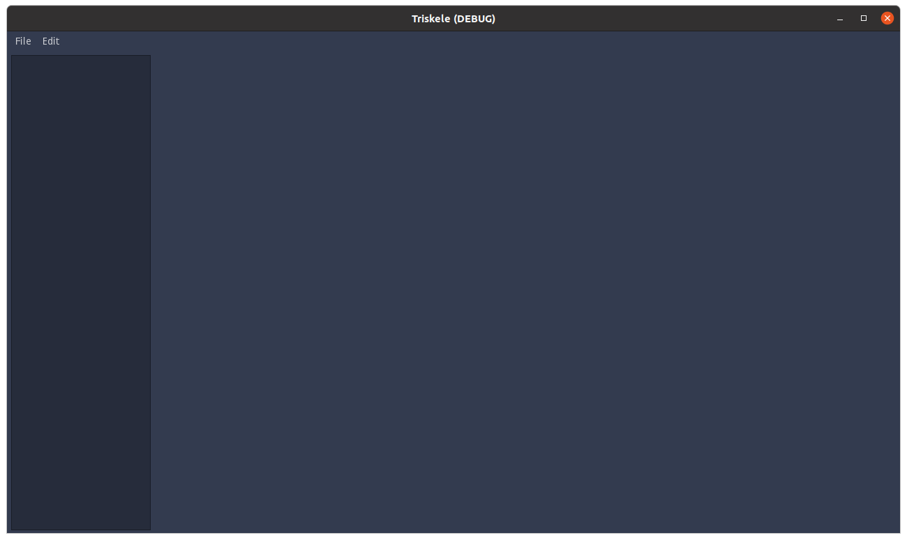
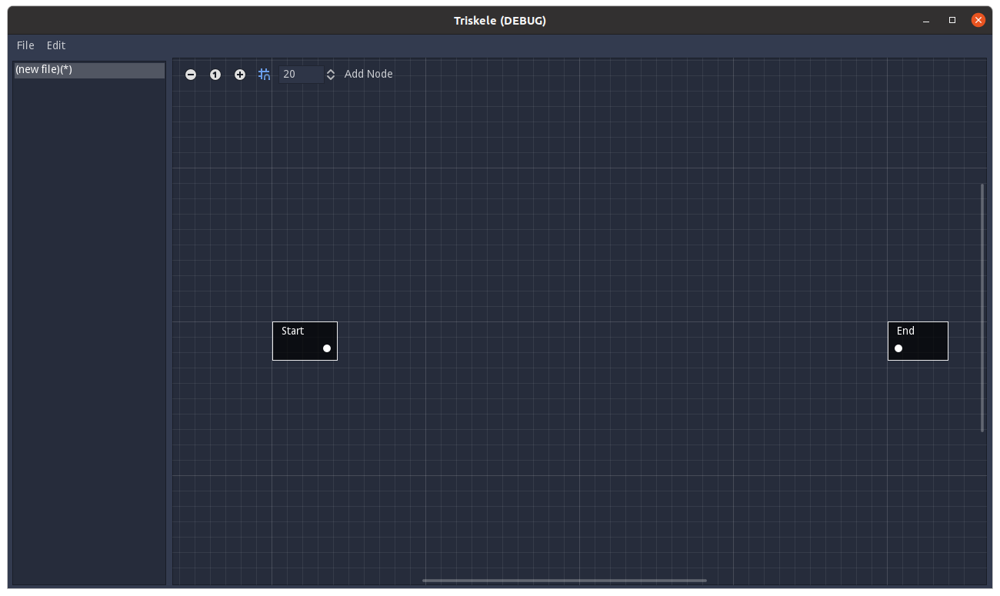
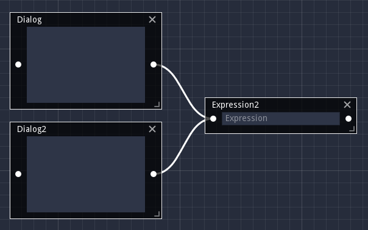
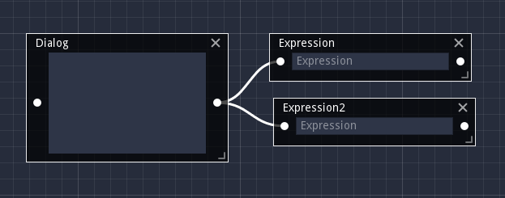
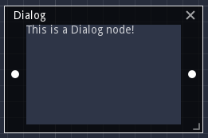
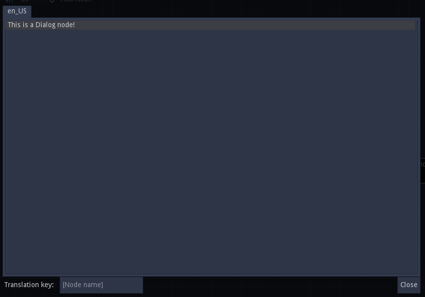
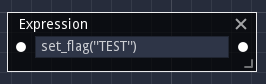
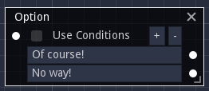
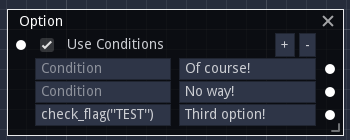
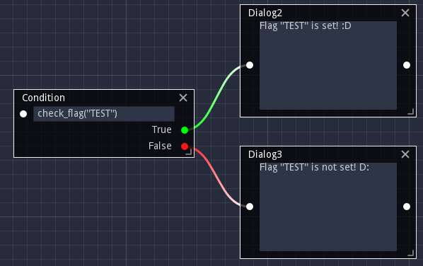

# Triskele usage
> **NOTE:** Triskele is still very new and can be very unstable. Save often, and make backups.

## Basic usage
When you first open Triskele, this is what you'll see:

The dark-colored bar on the right is called the **graphs list**; it contains all opened files. For now, it's empty.

By clicking the File button at the top-left, or right-clicking on the graphs list, you'll open a menu where you can add a new file. Once you do, you'll see this:

The new display on the right is called a **graph**. You can add multiple graphs via New File or Open File, and switch between them by clicking its name on the graph list.

Each graph contains **nodes**; there are two on the new graph you just created, a Start node and an End node. There are dots on the sides of the nodes; the dots on the left are called **input sockets**, while the dots on the right are **output sockets**.

> **Note:** Each input socket must connect to only ONE output socket! As of right now, Triskele doesn't enforce this, but the resulting files will be invalid! In other words, this is valid:
> 
> 
> 
> This is not:
> 
> 

The dialog tree starts at the Start node, and continues from socket to socket until it reaches the End node.

## Keybinds
> **NOTE:** As of right now, these keybinds cannot be changed due to a limitation with Godot Engine. See [this issue](https://github.com/godotengine/godot/issues/44307) for more information.

File menu:
* CTRL+N: New file
* CTRL+S: Save file
* CTRL+ALT+S: Save-As file
* CTRL+O: Open File
* CTRL+W: Close File

Edit menu:
* CTRL+Z: Undo
* CTRL+Y: Redo

## Nodes
### Dialog Node
The Dialog node is the main node type, and what most of your dialog tree will consist of. It contains text to be displayed by the game.

Clicking the label in the center pulls up a larger dialog editor, which you can use to write your text.

> **Note:** Multilanguage support is planned for the future, but as of right now, Triskele only supports English.

### Expression Node
The Expression node contains a line of code to be run by the game.

### Options Node
The Options node represents a list of options that the user can choose from. Options are added and removed via the +/- buttons at the top of the node.

If "Use Conditions" is checked, then a Condition box is added to the left of each option. These are expressions, which must return booleans. If the expression is false, the option is disabled and cannot be selected by players. If the Condition box is left empty, then the option is always choosable.

### Condition
The Condition node has an expression of its own, which must return a boolean. It then progresses to either True or False depending on the result.

